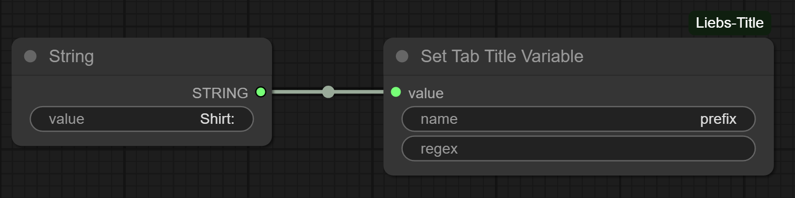

# ComfyUI-Liebs-Title

An extension to modify the browser tab title when running ComfyUI workflows.

## Features

* Browser tab title can be set directly using Right Click > Set Browser Tab Title.
* The title is saved with the graph and will restore when the workflow is re-opened.
* Use a node to set variables to be used in the title.

### Screenshots

| Screenshot | Description |
| :---- | :---- |
|  | Set the browser tab title using a menu option added to the right-click context menu. |

### Placeholder Variables

The tab title may contain placeholder variables with the format `%variableName%`. The `Set Tab Title Variable` node can take any input and create a variable for the tab title.

#### Built-in Variables

| Variable | Description |
| :---- | :---- |
| `%title%` | The original title before formatting by ComfyUI-Liebs-Title |

#### Setting a Variable

When the prompt is executed, the variable `%prefix%` will be populated with value `Shirt:`.

#### Setting Variables with Regular Expression Capturing Groups

Capturing groups from the regular expression will be mapped to variables. Specify the comma separated variable names in the same order as the capturing groups. When the following prompt is executed, the variables `%color%` and `%garment%` will be populated with values `Red` and `TShirt`.

## Example Tab Title Formats

| Tab Title Format | Example Result | Notes |
| :---- | :---- | :---- |
| `Make the shirt red` | Make the shirt red | |
| `Make the shirt red - %title%` | Make the shirt red - default - ComfyUI | Adding the original tab title. |
| `Make the shirt red - %title%` | Make the shirt red - [67%][67%] KSampler | While the prompt is running. |
| `%prefix%:%title%` | Shirt:default - ComfyUI | `%prefix%` is provided by a `Set Tab Title Variable` node. |
| `%color% - %garment% - %title%` | Red - TShirt - default - ComfyUI | `%color%` and `%garment%` are provided by a `Set Tab Title Variable` node. |
